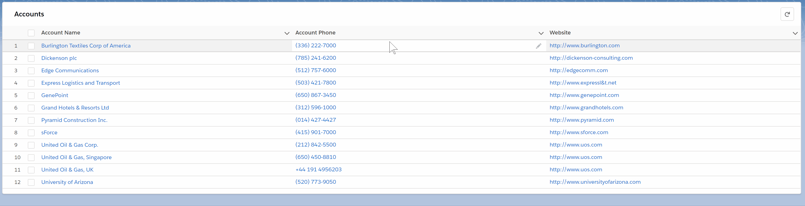

# SFDX App

## Dev, Build and Test

To setup, clone the repository locally, and from the home directory run `$ yarn`.

To test lwc components locally run `$ yarn:test` with sfdx installed.

To deploy authorize a dev hub in sfdx and run `$ sfdx force:org:create -f config/project-scratch-def.json -a MyScratchOrg` followed by `$ sfdx force:source:push -u MyScratchOrg`

## Resources

## Description of Files and Directories

### [datatable](force-app/main/default/lwc/datatable)
Takes as input an sObject and an array of fields and populates a datatable with records from the database.

### [Custom Related List](force-app/main/default/lwc/relatedList)
Related list for use on lightning app and record pages. Choose object, fields, etc.

## Issues
